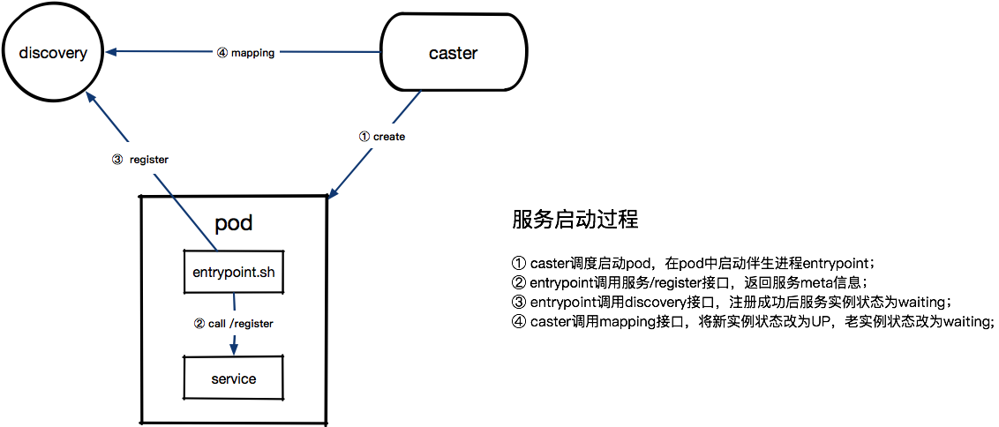
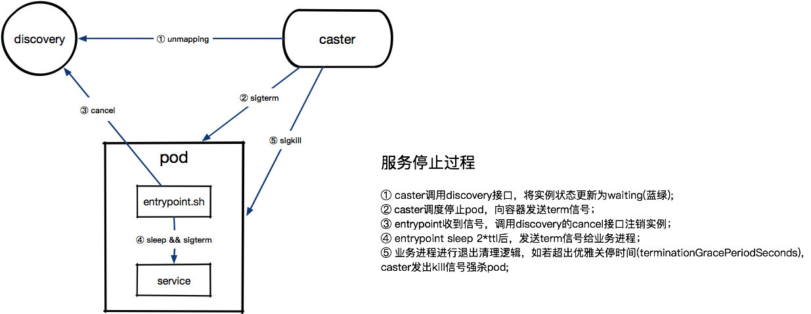

# 环境及配置说明

*注：以下名称IP等都是示例*

## 环境介绍

可用区zone: sh1, sh2  
sh1物理机三台：172.1.1.1, 172.1.1.2, 172.1.1.3  
sh2物理机三台：172.2.2.1, 172.2.2.2, 172.2.2.3  

## Supervisor

Discovery节点通过supervisor管理配置如下：  
```shell
[program:discovery]
name = discovery
command= /app/discovery -conf /conf/discovery.toml
autostart = true
autorestart = true
user = nobody
stdout_logfile = /log/discovery/stdout.log
stderr_logfile = /log/discovery/stderr.log
```

## SLB

sh1内SLB`sh1.discovery.bilibili.com`配置如下，sh2的`sh2.discovery.bilibili.com`类似：  
```nginx
upstream discovery_upstream {
    server 172.1.1.1:7171;
    server 172.1.1.2:7171;
    server 172.1.1.3:7171;
}
server{
    listen 80;
    server_name sh1.discovery.bilibili.com;
    location /discovery {
        // 此处省略其余配置...
        proxy_pass http://discovery_upstream;
    }
}
```

## DiscoveryNode配置

sh1的172.1.1.1节点`discovery.toml`配置如下，其余节点类似：  
```toml
zone = "sh1"
nodes = ["172.1.1.1:7171","172.1.1.2:7171","172.1.1.3:7171"]

[zones]
"sh2.discovery.bilibili.com" = "sh2"
# 注意，这里对应sh2的节点配置是 `"sh1.discovery.bilibili.com" = "sh1"`

[httpServer]
addr = "172.1.1.1:7171" # 注意IP配置为本机真实IP

[httpClient]
dial = "1s"
keepAlive = "120s"
```

# 使用说明

## 服务提供者

B站内部有k8s平台，平台名字叫caster。  

服务提供者启动过程中流程如下：



服务提供者停止过程中流程如下：



### 没上caster平台的服务

服务基于`naming/client.go`中SDK实现进程启动和退出时的register/renew/cancel，详细请看`naming/exanple_test.go`内示例代码

## 服务消费者

服务消费者通过使用`naming/client.go`中SDK实现依赖appID的fetchs/polls，详细请看`naming/exanple_test.go`内示例代码
